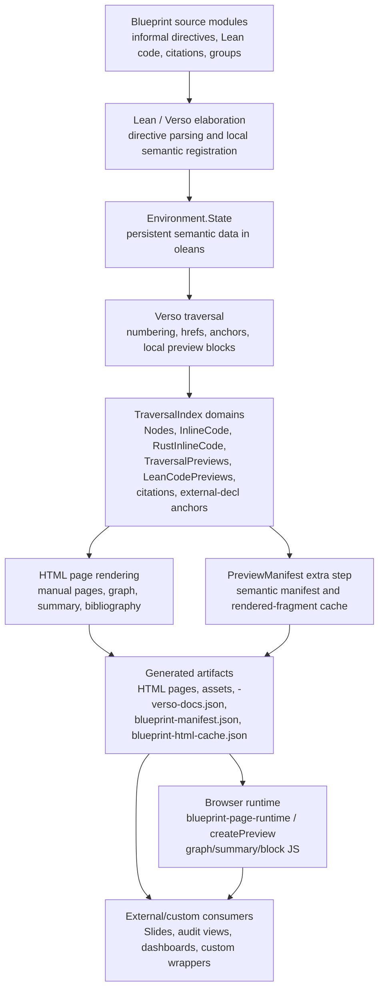
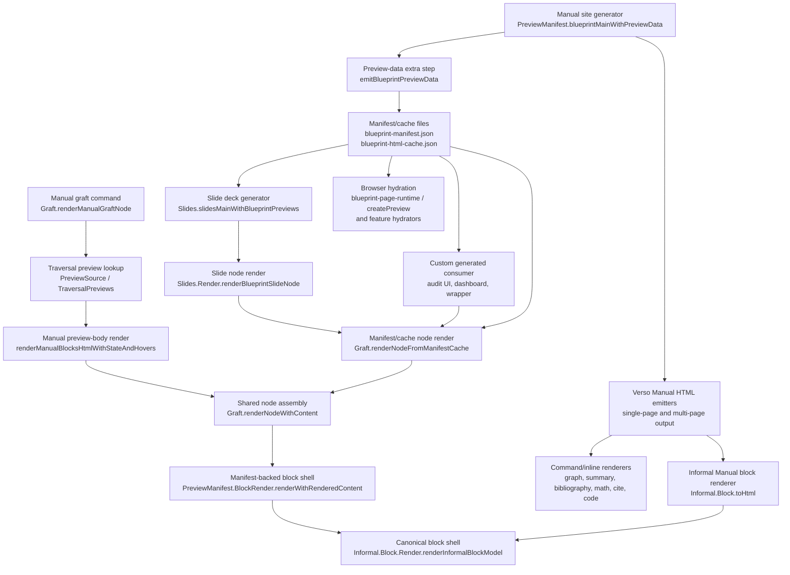

# Blueprint Design Rationale

Last updated: 2026-06-20

This document records the current architecture boundaries and the reasons the
Blueprint implementation is shaped the way it is.

It is intentionally not:

- the user-facing reference for options and rendering details
- the maintainer workflow guide
- the change backlog

Those responsibilities live in
[`MANUAL.md`](./MANUAL.md),
[`API.md`](./API.md),
[`MAINTAINER_GUIDE.md`](./MAINTAINER_GUIDE.md), and
[`ROADMAP.md`](./ROADMAP.md).

## Architecture Snapshot

### Canonical Semantic Source

Blueprint's core semantic model is a database of hybrid informal/formal
objects, each identified by a global label.

A labeled object may carry the informal statement or proof text, ownership and
group metadata, and links to formal material such as inline Lean code,
attributed compiled declarations, or external `(lean := "...")` references.

That database lives in `Environment.State`. Its object corpus lives in
`Environment.State.data`, with companion group and author metadata in the same
environment state. Elaboration and compilation are responsible for recording
the object-level facts and persisting them through Lean's compiled environment
data (oleans), rather than trying to precompute whole-site presentation.

Later, the generator binary re-enters that persisted state during Verso
traversal and assembles the final rendered metadata in document context.
Traversal resolves numbering, hrefs, cross-page references, previews, and
other relationships that depend on the whole rendered site rather than one
compiled object in isolation.

That boundary is deliberate. The environment answers "what is this informal
object, and what local formal/informal data belongs to it?" The
traversal/rendering pass answers "how do these objects sit inside this rendered
site?" Rendering and UI layers are expected to project from those two stages
rather than invent parallel sources of truth.

### Command Split

Command modules are split by concern:

- `VersoBlueprint/Graph.lean` owns the shared graph data model, finalized
  `GraphData` projection helpers, DOT rendering helpers, and graph-view
  variant construction used by page graphs and compact widgets
- `VersoBlueprint/GraphApi.lean` owns the traversal/cache-facing API for
  storing semantic graph data and finalizing it against completed traversal
  state
- `VersoBlueprint/Commands/Graph.lean`
- `VersoBlueprint/Commands/Summary.lean`
- `VersoBlueprint/Commands/Bibliography.lean`
- generic command CSS and lightweight asset-bundle plumbing in
  `VersoBlueprint/Commands/Common.lean`
- the target-details opener in `VersoBlueprint/Commands/open-target-details.mjs`
- shared graph-data browser helpers in `VersoBlueprint/blueprint-graph-core.mjs`
- shared preview URL/key browser helpers in
  `VersoBlueprint/blueprint-preview-core.mjs`
- shared generated ESM wrapper helpers in
  `VersoBlueprint/blueprint-api-common.mjs`
- the standalone generated-data API in
  `VersoBlueprint/blueprint-data-api.mjs`
- the private preview base/debug helpers in
  `VersoBlueprint/Commands/preview-runtime-base.mjs`
- the private preview-data/cache runtime helpers in
  `VersoBlueprint/Commands/preview-runtime-data.mjs`
- the private preview render helpers in
  `VersoBlueprint/Commands/preview-runtime-render.mjs`
- the private preview hydration helpers in
  `VersoBlueprint/Commands/preview-runtime-hydration.mjs`
- the private preview lifecycle helpers in
  `VersoBlueprint/Commands/preview-runtime-lifecycle.mjs`
- the private preview surface helpers in
  `VersoBlueprint/Commands/preview-runtime-surface.mjs`
- the private template-preview descriptor binder in
  `VersoBlueprint/Commands/preview-runtime-template.mjs`
- the shared browser API/bootstrap body in
  `VersoBlueprint/Commands/preview-runtime-api.mjs`
- the private graph runtime helpers in
  `VersoBlueprint/Commands/graph-runtime-core.mjs`
- the graph rendering client in `VersoBlueprint/Commands/graph.mjs`
- the inline-hover preview client in `VersoBlueprint/Commands/inline-preview.mjs`
- descriptor-driven summary and code-summary preview binding in the shared
  preview runtime

Informal-block support is now split across smaller modules instead of one large
`Block.lean` bucket:

- `Informal/Block.lean`:
  statement/proof block elaboration plus the top-level HTML block renderer
- `Informal/Block/Assets.lean`:
  block-specific CSS
- `Informal/Block/relation-panel.mjs`:
  relation-panel preview binding (`uses`, `used by`, and group panels)
- `Informal/Block/Store.lean`:
  stored-block lookup, merge, and numbering-resolution helpers used during
  traversal/rendering
- `Informal/MetadataView.lean`:
  shared metadata presentation policy used by block rendering and summary
  badges
- `Informal/Block/Common.lean`:
  shared block/code data structures and lightweight code-hover/panel markup
  helpers

Shared preview and rendering helpers live in `VersoBlueprint/Lib/`, notably:

- `HoverRender.lean`
- `PreviewSource.lean`

Shared and feature-specific browser assets are written as ESM source modules.
Regular Manual pages receive them through `PreviewManifest.lean` and the
generated `blueprint-page-runtime.mjs` entrypoint; the current Slides output path
uses `Slides/ClassicPreviewAdapter.lean` as the only ESM-to-classic wrapper.
The private source modules are:

- `Commands/preview-runtime-data.mjs`
- `Commands/preview-runtime-base.mjs`
- `Commands/preview-runtime-render.mjs`
- `Commands/preview-runtime-hydration.mjs`
- `Commands/preview-runtime-lifecycle.mjs`
- `Commands/preview-runtime-surface.mjs`
- `Commands/preview-runtime-template.mjs`
- `Commands/preview-runtime-api.mjs`
- `Commands/inline-preview.mjs`
- `Commands/open-target-details.mjs`
- `Commands/graph-runtime-core.mjs`
- `Commands/graph.mjs`
- `blueprint-graph-core.mjs`
- `blueprint-preview-core.mjs`
- `Informal/Block/relation-panel.mjs`

Per-command CSS overlays stay with their commands:

- `Commands/graph.css`
- `Commands/summary.css`
- `Commands/bibliography.css`

Browser asset composition is intentionally separate from physical emission.
`Informal.Commands.BlueprintAssetBundle` in `Commands/Common.lean` records the
ordered CSS and any feature-local JavaScript fragments needed by a Blueprint
feature. Manual pages consume CSS through Verso `HtmlAssets` and load runtime
JavaScript through the generated ESM page runtime. Slides build their standalone
classic-script file through `Slides/ClassicPreviewAdapter.lean`. The Python
`EMBEDDED_ASSET_OWNERS` inventory remains rebuild metadata for `include_str`
owner modules, not the semantic source of asset ordering.

## Rendering Clients

The same Blueprint object data is consumed in three broad ways:

1. local chapter content:
   inline references, informal blocks, and attached code snippets
2. global overview pages:
   graphs, summaries, and bibliography-style rollups
3. interactive clients:
   previews, widgets, and other runtime surfaces

This split is why one-source-of-truth pressure matters so much: local blocks,
global pages, and runtime widgets all need to agree on the same semantics while
projecting them differently.

## Blueprint Data Workflow

Blueprint has one semantic authoring model, but it deliberately crosses several
phase boundaries before a generated site is interactive. Each boundary exists
because the next phase owns facts that the previous phase cannot know yet:
compiled Lean elaboration owns local object semantics, Verso traversal owns
site-local anchors and numbering, preview-data emission owns whole-site cache
artifacts, and browser JavaScript owns interaction and hydration.

The current workflow is:

The same flow can be read as four contracts:

1. **Elaboration to environment.**
   Source directives, inline Lean blocks, `@[blueprint "..."]` attributes,
   external `(lean := "...")` references, group declarations, author
   declarations, citations, and metadata are elaborated into
   `Informal.Environment.State`. This is the canonical semantic store for
   Blueprint-owned facts. It is persisted through Lean environment extensions
   and imported through compiled oleans, so downstream modules see one merged
   object database.

2. **Environment to traversal.**
   During Verso traversal, Blueprint reads the semantic environment and writes
   render-time indexes into `TraverseState` through `TraversalIndex`. This is
   where site-local facts are created: rendered anchors, numbering caches,
   code-panel destinations, group and reverse-use panels, citation use sites,
   statement/proof preview entries, Lean declaration preview entries,
   public graph data records, and external declaration row anchors. These
   facts are intentionally not pushed back into `Environment.State`, because
   their values depend on the current rendered document and output mode.

3. **Traversal to generated artifacts.**
   Page rendering and preview-data emission both consume the traversal state.
   HTML pages get the visible document, graph, summary, bibliography, inline
   preview triggers, and feature-specific assets. The Blueprint preview-data
   extra step emits two structured files under `-verso-data/`:
   `blueprint-manifest.json`, which contains semantic preview entries, public
   graph data, and metadata, and `blueprint-html-cache.json`, which contains
   opaque rendered fragments plus the hover side data needed to hydrate those
   fragments inside generated pages.

4. **Artifacts to runtime and external consumers.**
   Browser code should treat the generated artifacts as immutable inputs. Page
   markup carries stable lookup keys and lightweight data attributes. Generated
   ESM clients that only need data import `api/data.mjs`, call
   `createPreviewData()`, and receive manifest/cache/graph loaders without DOM
   rendering dependencies. ESM clients that need rendering import
   `api/preview.mjs`, call `createPreview()`, and receive a renderer assembled
   directly from the emitted runtime chunks. Generated
   regular Manual pages load `blueprint-page-runtime.mjs` as a module script.
   That runtime calls `createPreview()` and starts Blueprint's graph,
   relation-panel, inline-preview, and template-preview bindings from one
   renderer instance. The current classic-script Slides adapter uses the
   internal `window.VersoBlueprint.onRenderReady` bridge to receive that same
   API shape. The API loads manifest/cache entries, inserts cached fragments as
   opaque HTML, hydrates nested preview widgets, renders math, and applies
   panel behavior.
   Feature-owned JavaScript such as graph, summary, relation-panel,
   inline-preview, and slide code binds those generic helpers to a concrete UI.
   Inline JavaScript asset order is not used as a readiness guarantee.
   Custom consumers should prefer the manifest/cache pair over scraping page
   HTML or re-solving Blueprint labels.

### Workflow Sources Of Truth

The main rule is: each fact has one owning phase, and later phases project from
that owner.

| Fact family | Owner | Stored as | Main consumers |
| --- | --- | --- | --- |
| Blueprint labels, node kind, declared dependencies, parent/group, owner, tags, priority, effort, PR URL | Elaboration | `Environment.State.data` and related environment maps | traversal, graph, summary, manifest construction |
| Group and author declarations | Elaboration | `Environment.State.groups` and `Environment.State.authors` | block rendering, summary, graph/group panels |
| Inline Lean and Rust attachments | Elaboration plus traversal | semantic code refs in environment; render-time code-panel indexes in `TraversalIndex.InlineCode` and `TraversalIndex.RustInlineCode` | block renderers, code panels, manifest entries |
| External Lean declaration snapshots | Elaboration / declaration snapshot registration | `ExternalRef` records on semantic nodes, enriched with presence/status/source/render data | block renderers, code-summary badges, summary, graph, manifest |
| Numbering, hrefs, anchors, preview keys | Traversal | `TraverseState` and `TraversalIndex` domains | page rendering, preview manifest, browser triggers |
| Statement/proof preview source blocks | Traversal | `TraversalIndex.TraversalPreviews` | manifest/cache emission, same-document manual grafts |
| Public graph data | Elaboration plus completed traversal | semantic `Informal.Graph.GraphData` cached in `TraversalIndex.Graphs`, then finalized through `Informal.GraphApi.finalData` for `blueprint-manifest.json.graphs`, page JSON, and bundled graph rendering | graph command rendering, browser runtime, custom graph consumers |
| Lean declaration preview fragments | Traversal | `TraversalIndex.LeanCodePreviews` | Lean links, manifest/cache emission |
| Rendered preview bodies | Preview-data emission | `blueprint-html-cache.json` | browser runtime, Slides, custom generated consumers |
| Semantic preview/catalog entries | Preview-data emission | `blueprint-manifest.json` | browser runtime, Slides, audit/custom UIs |
| Interaction state | Browser runtime | DOM state only | previews, panels, graph controls, custom wrappers |

This is why Blueprint keeps manifest state and traversal state separate even
when they describe the same object. Traversal state is the live, generator-local
working set. Manifest state is the serialized interchange artifact for
generated consumers. A renderer may project traversal state into manifest-shaped
entries for code reuse, but it should not pretend that generated manifest files
are the traversal source of truth inside the current generator.

### Render Path Inventory

There are several Blueprint render callers, but only a few true assembly
layers. The useful split is:

The current paths are:

| Path | Entry point | Data input | Shared assembly point | Output |
| --- | --- | --- | --- | --- |
| Normal Manual site pages | `Informal.PreviewManifest.blueprintMainWithPreviewData` | `Environment.State` plus `TraverseState` | `Informal.Block.Render.renderInformalBlockModel` for informal blocks; command-specific renderers for graph, summary, and bibliography | generated Manual HTML pages and assets |
| Preview manifest/cache emission | `Informal.PreviewManifest.emitBlueprintPreviewData` via `blueprintMainWithPreviewData` | completed Manual `TraverseState` and `TraversalIndex` domains | Manual preview render helpers plus manifest entry builders | `blueprint-manifest.json`, `blueprint-html-cache.json`, merged hover docs |
| Manual same-document graft | `Informal.Graft.renderManualGraftNode` through `{blueprint_node}` in Manual | current page traversal preview entry and current `TraverseState` | `Informal.Graft.renderNodeWithContent` | grafted Manual HTML block |
| Manual side-by-side graft wrapper | `Block.blueprintGraftSideBySide.toHtml` | already elaborated/rendered child blocks | wrapper only; child nodes follow the Manual graft path | side-by-side Manual HTML wrapper |
| Slides graft node | `Informal.Slides.slidesMainWithBlueprintPreviews` plus `Informal.Slides.renderBlueprintSlideNode` | serialized manifest/cache files copied from the Blueprint site | `Informal.Graft.renderNodeFromManifestCache` then `renderNodeWithContent` | static slide-node HTML plus slide assets |
| Slides side-by-side wrapper | `VersoSlides.BlockExt.wrap` emitted by `blueprint_side_by_side` in Slides | already rendered child slide blocks | upstream Slides wrapper; child nodes follow the Slides graft-node path | side-by-side slide HTML wrapper |
| External/custom generated consumers | direct calls to `Informal.Graft.renderNodeFromManifestCache` | serialized manifest/cache files | `Informal.Graft.renderNodeFromManifestCache` then `renderNodeWithContent` | consumer-owned HTML wrapper |
| Browser preview/panel hydration | `blueprint-page-runtime.mjs` for regular Manual pages; `api/preview.mjs` `createPreview()` for custom clients; internal `window.VersoBlueprint.onRenderReady` for the classic Slides adapter; registered feature hydrators | generated page markup, manifest/cache files, `-verso-docs.json` | JavaScript hydration only | interactive previews, panels, math, links |

This inventory is also the answer to "how many render contexts do we have?" for
grafted Blueprint nodes. `VersoBlueprint.Graft.Render` owns the one concrete
manifest/cache render context, `Informal.Graft.RenderContext`. It stores the
manifest index, HTML-cache index, and error logger. `VersoBlueprint.Slides.Render`
uses that context with slide-specific render configuration. Manual
grafts do not use a manifest render context, because they already have the live
`TraverseState`; they still end at `Informal.Graft.renderNodeWithContent` so the
block shell is assembled the same way.

Traversal-time relation panels use `Informal.RelatedPanel.RelationContext`,
which is deliberately narrower than the graft manifest/cache context: it only
packages the live traversal state and stored informal blocks needed to compute
group, uses, and used-by panel rows.

### Browser Rendering Path Inventory

The browser rendering paths intentionally converge on one renderer shape, but
they do not all start the same way. Use this inventory before adding a new
runtime hook or moving code between feature modules.

| Path | Startup owner | Semantic source | Rendering and interaction owner |
| --- | --- | --- | --- |
| Regular generated Manual pages | `blueprint-page-runtime.mjs` imported from `extraHead` | `blueprint-manifest.json`, `blueprint-html-cache.json`, graph JSON embedded in graph blocks | One `createPreview()` renderer starts inline previews, relation panels, graph blocks, and template-preview descriptor binding. |
| Custom ESM preview clients | `api/preview.mjs` and caller-created `createPreview()` renderer | Manifest/cache plus optional canonical generated pages | The stable preview API loads data, inserts rendered fragments or canonical nodes, runs math, and hydrates nested Blueprint widgets. |
| Data-only clients | `api/data.mjs` and caller-created `createPreviewData()` data API | Manifest/cache and manifest graph records | No DOM rendering; callers own all UI and use the data API for URL construction, loading, status, and single-entry lookup. |
| Graph clients | `api/graph.mjs` | Finalized graph records from the manifest or graph data embedded beside a graph block | Data helpers stay graph-only; render helpers lazy-load `Commands/graph.mjs` and require an explicit preview renderer for graph preview panels. |
| Blueprint-owned panel features | `blueprint-page-runtime.mjs` or the Slides adapter passes a renderer into feature startup | Manifest/cache entries and feature-owned Lean-emitted attributes | Feature scripts adapt `createPreviewSurface`, `renderPreviewIntoSurface`, `resolvePreviewHtml`, and lifecycle helpers to concrete panel UIs. |
| Summary and code-summary previews | Lean emits descriptor attributes; `preview-runtime-template.mjs` binds them at page load and after hydration | Descriptor attributes plus local templates or manifest/cache lookup keys | The shared template binder creates surfaces and triggers; no feature-specific startup module owns this path. |
| Current classic-script Slides output | `Slides/ClassicPreviewAdapter.lean` installs the private `window.VersoBlueprint.onRenderReady` bridge | Same manifest/cache and generated node markup as other consumers | Classic-script compatibility wraps the ESM runtime chunks and should stay isolated until Slides move to an ESM entrypoint. |

Two invariants keep these paths from drifting apart:

1. A custom client starts from a generated public ESM module, not from
   `Commands/*.mjs` implementation chunks or `window.VersoBlueprint`.
2. A bundled panel feature may configure a preview surface, but it should not
   reimplement manifest/cache loading, panel slot updates, trigger lifetime,
   dismissal, repositioning, or preview diagnostics.

### Node Component Ownership

A rendered Blueprint node is intentionally assembled from a small set of owned
components. When adding or changing node UI, use this table as the duplication
check: a component should have one semantic renderer, with genre- or
browser-specific code limited to configuration, lookup, insertion, or
hydration.

| Component | Single owner | Used by | Duplication status |
| --- | --- | --- | --- |
| Node wrapper, heading, title row, label, body container, and folded/open details shape | `Informal.Block.Render.renderInformalBlockModel` through `renderInformalBlockShell` | normal Manual blocks, manifest/cache rendering, grafted nodes, Slides nodes | single Lean owner |
| Statement metadata panel for owner, effort, priority, tags, and PR link | `Informal.Block.Render.renderStatementMetadataPanel` fed by `MetadataPresentation` | normal Manual blocks and manifest/cache-backed nodes | single node owner; summary renders separate badge views from the same metadata model |
| Header-extra slot ordering and wrapper classes | `Informal.Block.Render.renderHeaderExtras` | group, uses, used-by, code, and custom extras in normal and manifest-backed nodes | single layout owner |
| Relation panel/chip markup and relation-row badges | `Informal.RelatedPanel.renderPanel`, with shared axis-badge fragments from `Informal.RelatedPanel` | normal Manual nodes and manifest/cache-backed nodes through `PreviewManifest.BlockRender` | single Lean owner for panel markup and statement/proof badge vocabulary |
| Relation panel browser activation, selection state, and loading/error messages | `Informal/Block/relation-panel.mjs` configured with `Commands/preview-runtime-surface.mjs` `createPreviewSurface` and `renderPreviewIntoSurface` | relation panels emitted by normal, grafted, Slides, and custom generated nodes | single module-shaped owner for feature behavior; panel slots plus trigger/dismiss lifetime are shared through the surface, and manifest/cache lookup plus stale-request replacement go through the runtime helper |
| Code-summary trigger, template, and preview panel shell | `Informal.HoverRender.templatePreviewRoot`, configured by `Informal.CodeSummary.renderCodeSummaryPreview` | heading code badges and code-panel indicators | shared wrapper helper, code-summary-specific selectors |
| Declaration-level Lean status labels, classes, and symbols | `Informal.Data.ProvedStatus.presentation` | code-summary declaration rows, summary detail rows, heading status marks, heading code-entry icons, external-code rows/footers, rendered external declaration header badges | single presentation owner for declaration status; renderers still own their surrounding HTML |
| Code-summary semantics, declaration rows, status marks, and indicators | `Informal.CodeSummary` using `ProvedStatus.presentation` for declaration-status vocabulary | node heading code extra and code-panel summary indicator | single code-summary owner; declaration status presentation is delegated to `ProvedStatus` |
| Companion Lean/external-code panel shell | `Informal.mkCodePanel` | inline Lean panels, external declaration panels, Rust panels, manifest/cache-backed code panels | single panel-shell owner |
| External declaration rows and rendered declaration body strategy | `Informal.ExternalCode.renderExternalDeclRowsWith` | external-code panels and HTML-cache-backed Lean-code previews | shared row/status/footer owner with page-hover and self-contained body strategies |
| Manifest/cache-backed block shell assembly | `Informal.PreviewManifest.BlockRender.renderWithRenderedContent` | Slides, grafts, and custom generated consumers | single manifest-backed assembly owner; callers only supply config and content |
| Graft node lookup, diagnostics, and outer graft attrs | `Informal.Graft.renderNodeFromManifestCache` / `renderNodeWithContent` | Manual grafts, Slides grafts, external generated consumers | single graft owner |
| Browser generated-data URLs and preview keys | `blueprint-preview-core.mjs` shared by the page runtime, `api/data.mjs`, and `api/preview.mjs` | browser runtime, ESM data/preview clients, custom generated pages | single ESM owner for generated-data URL construction and preview-key formatting; runtime stores and ESM helpers delegate to it instead of reimplementing the same string rules |
| Browser graph JSON discovery and graph manifest loading | `blueprint-graph-core.mjs` shared by the page runtime and `api/graph.mjs` | graph command runtime, graph dashboards, custom browser clients | single ESM owner for graph-data normalization and graph JSON/script discovery; runtime code reaches it through the render API rather than compatibility globals |
| Browser manifest/cache loading and body-fragment insertion | `Commands/preview-runtime-data.mjs` factory-backed data/cache loading exposed through `api/data.mjs`, plus `Commands/preview-runtime-render.mjs` `resolvePreview` and `renderPreviewInto`, with `Commands/preview-runtime-surface.mjs` `resolvePreviewHtml` and `renderPreviewIntoSurface` adapting those helpers for bundled surfaces | graph, summary, relation panels, inline previews, custom browser clients | ESM data/cache and render owners; each data API instance owns its stores, delegates URL/key primitives to preview core and graph data to graph core, while the render chunk consumes the supplied data API and joins entries with rendered fragments |
| Browser canonical generated-node insertion | `Commands/preview-runtime-render.mjs` `resolveCanonicalPreview` and `renderCanonicalPreviewInto` | standalone/custom browser clients that want regular Blueprint node visuals | single ESM canonical-preview owner; source-page loading accepts renderer-local `fetchText`, `loadDocument`, `canonicalBaseUrl`, and cache options |
| Browser preview panel behavior | `Commands/preview-runtime-surface.mjs` `createPreviewSurface`, `hidePreviewSurfaces`, and panel helpers plus `Commands/preview-runtime-lifecycle.mjs` trigger/dismiss/reposition helpers | summary, code-summary, inline-preview, relation-panel, Slides, and graph feature scripts | single ESM behavior helper; feature scripts pass selectors/defaults through rendered descriptors or feature-specific callbacks instead of owning panel slots, trigger lifetimes, dismissal binding, or close-button wiring |
| Browser preview-panel DOM creation and runtime diagnostic message markup | `Commands/preview-runtime-surface.mjs` `createPreviewPanel`, `createPreviewSurface`, and `previewMessageHtml` | inline preview panels, relation-panel runtime errors, and future bundled feature panels that need runtime-created chrome | single ESM panel/message/surface construction helper; feature scripts pass classes/slots/text |
| Browser inline-preview panel behavior, child panel, footer, and nested hover behavior | `Commands/inline-preview.mjs` configured with explicit host policies plus `Commands/preview-runtime-surface.mjs` `createPreviewSurface` and lifecycle helpers | inline Lean links, bibliography links, single relation chips, nested previews | feature-owned preview lookup and nested-panel rules; graph/relation host behavior is data in the inline script, while panel slots, header/footer updates, close-button behavior, trigger lifetime, pointer checks, and resize/scroll binding use surfaces |
| Browser graph preview, group-hover, popover, dismiss, and reposition behavior | `Commands/graph-runtime-core.mjs` for graph runtime utilities plus `Commands/graph.mjs` configured with runtime surfaces and popover helpers | graph command output, generated graph ESM render helpers, and Slides graph refresh hooks | feature-owned graph state; normalization, canvas sizing, script loading, state slots, and graph-specific positioning are shared by the graph runtime core, while graph rendering and UI event orchestration stay in the graph feature script and are surfaced to custom clients through `api/graph.mjs` rather than direct support-file imports |
| Browser summary and code-summary preview binders | `Informal.HoverRender.templatePreviewDescriptorAttrs` emitted by Lean and auto-bound by `Commands/preview-runtime-template.mjs` | summary page labels and code-summary triggers in Manual pages, grafted nodes, and Slides | selector configuration is data on the rendered root; no per-feature JS binder owns this path |

When adding node UI, use this checklist before introducing a renderer or
browser helper:

1. Identify the semantic owner for the component in the table above.
2. Keep genre-specific Lean code to lookup, options, rendered body content, or
   caller-provided attributes.
3. Keep browser code to cache lookup, insertion, hydration, and interaction
   behavior; do not reconstruct node semantics from DOM fragments.
4. Prefer existing shell, metadata, relation-panel, code-panel, and preview
   helper APIs before adding a new wrapper.
5. Add a new owner to this table when a genuinely new component appears.

### Render-Path Consequences

The workflow implies a few constraints for renderers:

- **Manual rendering can use traversal directly.**
  Same-document commands such as Manual grafts can resolve the target through
  traversal indexes because the current page traversal state is available. They
  may still project the result into the manifest entry shape so the block shell
  and relationship panels use the same assembly code as generated consumers.

- **Generated consumers use manifest/cache.**
  Slides, external audit interfaces, and custom dashboards should read
  `blueprint-manifest.json` plus `blueprint-html-cache.json`. They should not
  reconstruct relationship panels, code bodies, status badges, or hover payloads
  by scanning raw document HTML.

- **Browser JavaScript hydrates; it does not own semantics.**
  Runtime code may load cached HTML, insert it into panels, render math, and
  bind nested preview handlers. It should not decide whether a node is
  formalized, which dependencies exist, or how related panels are structured.
  Browser clients that only need data should use `createPreviewData()` from
  `api/data.mjs`; browser clients that render should use `createPreview()` from
  `api/preview.mjs`. Regular generated Manual pages import
  `blueprint-page-runtime.mjs` from `extraHead`; that module creates the page
  renderer and starts the generated feature hydrators. The classic-script
  Slides adapter uses the internal `window.VersoBlueprint.onRenderReady` bridge. This
  keeps preview synchronization on one runtime API shape instead of splitting
  lookup and hydration across feature-owned helpers or relying on incidental
  inline-script order. Custom clients that need non-default data access should pass `dataBaseUrl` or
  `fetchJson` to `createPreviewData` or `createPreview`; clients that need
  non-default canonical-page loading should pass `fetchText`, `loadDocument`,
  or `canonicalBaseUrl` to `createPreview`; clients that need post-insertion
  behavior should pass hydrators to `createPreview({ hydrators })` or to the
  individual render call. They should not register page-global hooks just to
  make a standalone view work.

- **The browser render API has two tiers.**
  Data-only clients should treat `createPreviewData()` from `api/data.mjs` as
  the stable manifest/cache/graph-loading surface. Render clients should treat
  `createPreview()`, manifest/cache loading and status readers, keyed lookup,
  `resolvePreview`, `renderPreviewInto`, `resolveCanonicalPreview`,
  `renderCanonicalPreviewInto`, `renderNode`, and `hydrate` as the stable
  integration surface. `resolvePreview` and
  `renderPreviewInto` expose body fragments for clients that own their wrapper.
  The canonical-preview helpers follow the manifest entry's generated-page
  link and extract the actual Lean-rendered Blueprint node wrapper, so clients
  that want normal Blueprint visuals do not need to reconstruct headings,
  relation chips, or code extras in JavaScript. Blueprint's bundled feature
  scripts also share helper methods for runtime panel creation, surface-owned
  trigger/dismissal binding, surface-owned panel positioning and pointer
  checks, template-root binding, and feature hydrator registration. Custom
  renderers can instead provide factory-level data, canonical-loading, and
  hydration defaults with
  `createPreview({ dataBaseUrl, fetchJson, fetchText, loadDocument, canonicalBaseUrl, hydrators, inheritPageHydrators, templateBinder })`
  and per-call overrides through the render options object. `fetchJson` is the
  explicit boundary for custom caches, authenticated fetches, tests, and
  Node-like clients that do not have a browser page location; `fetchText` and
  `loadDocument` are the equivalent boundary for canonical generated-page
  loading. The internal hydrator registry remains a bridge for generated page
  and slide feature startup; it is not the preferred custom-client extension
  point. Those helpers keep bundled graph, summary, relation-panel,
  inline-preview, and slide scripts on one runtime path. `createPreviewSurface` is the
  component-shaped helper in this tier: it groups panel slots, behavior state,
  custom body rendering, content updates, trigger binding, dismissal binding,
  reposition binding, pointer checks, and keep-open checks without exposing a
  stable external contract. These helpers are not a public custom-client
  contract unless promoted into the API reference's stable API table. New public
  browser APIs should start as stable custom-client entries only when an
  external interface can describe its responsibility without depending on
  Blueprint-owned DOM structure; otherwise they should remain bundled helpers
  until the argument shape is clearer.

  The public generated-site module boundary is intentionally narrower than the
  implementation module graph. `api/data.mjs`, `api/preview.mjs`, and
  `api/graph.mjs` are the browser import targets for clients. The sibling
  `blueprint-*-core.mjs`, `blueprint-api-common.mjs`, and `Commands/*.mjs`
  modules are emitted so generated pages, Slides, and the public API wrappers
  can share one runtime path; they are not a custom-client contract merely
  because they are ESM modules.

- **Split JavaScript by responsibility, not feature semantics.**
  The preview runtime is emitted as ESM support modules for regular Manual
  pages and public generated APIs. The current Slides path wraps those modules
  into one classic-script asset through `Slides/ClassicPreviewAdapter.lean`.
  The source is split across private source chunks:
  `blueprint-preview-core.mjs` owns generated-data URL helpers and preview-key
  construction shared by generated pages, `api/data.mjs`, and
  `api/preview.mjs`; `blueprint-api-common.mjs` owns the common wrapper
  mechanics for the generated public ESM APIs, such as default `dataBaseUrl`
  handling, URL/key forwarding, default API handles, status fallbacks, and
  method dispatch; `blueprint-data-api.mjs` owns the standalone data-only public
  module; `preview-runtime-data.mjs` owns factory-backed manifest/cache decoding
  and loading, load-status readers, entry lookup, and graph-core delegation, and
  is emitted as an ESM support module for `api/data.mjs`/`api/preview.mjs`;
  `preview-runtime-render.mjs` owns manifest/cache joins, rendered-fragment
  insertion, and canonical-node loading through injected data and canonical page
  loaders; `preview-runtime-hydration.mjs` owns fragment hydration, math
  rendering, and feature hydrator dispatch; `preview-runtime-lifecycle.mjs` owns
  trigger, dismissal, popover, and reposition lifetimes;
  `preview-runtime-surface.mjs` owns panel slots, content updates, and
  diagnostic markup; `preview-runtime-template.mjs` owns rendered descriptor
  binding; `preview-runtime-base.mjs` owns tiny shared utilities and debug
  hooks; and `preview-runtime-api.mjs` owns API assembly plus the private bridge
  that the classic Slides adapter installs on `window.VersoBlueprint`. These
  groups are deliberately close to future component boundaries. A split source
  file may load files, join entries by preview key, insert opaque fragments, own a
  preview surface's local UI state, or call hydrators; it should not infer
  Blueprint relation topology, ownership, status, or code associations from
  HTML markup.

  Future splits should preserve the current public API while moving private
  helpers behind files that match their responsibility:

  | Boundary | Current responsibility | Split target |
  | --- | --- | --- |
  | Page runtime entrypoint | Construct one renderer for regular generated Manual pages and start the page-owned feature hydrators without a global window hook. | `blueprint-page-runtime.mjs` emitted as a module script through Manual `extraHead` |
  | API assembly/readiness | Assemble the stable render API for `createPreviewRuntimeApi`; keep the private `window.VersoBlueprint` bridge isolated to the classic Slides adapter. | `Commands/preview-runtime-api.mjs` emitted as an ESM support module |
  | Preview URL/key primitives | Resolve `-verso-data` URLs and normalize preview keys for page-runtime and custom ESM clients. | `blueprint-preview-core.mjs` shared implementation file |
  | Generated ESM wrapper mechanics | Share default `dataBaseUrl` setup, URL/key forwarding, default API handles, fallback statuses, and method dispatch across public ESM entrypoints without sharing their stores. | `blueprint-api-common.mjs` internal support file emitted for `api/data.mjs` and `api/preview.mjs` |
  | Preview data access | Load manifest/cache JSON through the configured `fetchJson` or ambient `fetch`, keep load status, delegate graph data to graph core, and look up entries. | `Commands/preview-runtime-data.mjs` emitted as an ESM support module |
  | Data-only public API | Expose manifest/cache/graph loading without importing DOM rendering, hydration, or surfaces. | `blueprint-data-api.mjs` re-exported as `api/data.mjs` |
  | Fragment rendering | Resolve manifest/cache pairs through an injected data API, produce diagnostics, insert rendered fragments, and fetch canonical node wrappers through injectable page loaders. | `Commands/preview-runtime-render.mjs` emitted as an ESM support module |
  | Hydration registry and explicit hydrator options | Run math rendering plus generated-page feature hydrators after insertion, while allowing custom clients to pass renderer-local or call-local hydrators. | `Commands/preview-runtime-hydration.mjs` emitted as an ESM support module |
  | Template binding | Convert rendered descriptor attributes into runtime preview triggers. | `Commands/preview-runtime-template.mjs` emitted as an ESM support module |
  | Preview surfaces | Own panel slots, body updates, local state, and surface-level callbacks. | `Commands/preview-runtime-surface.mjs` emitted as an ESM support module |
  | Lifecycle binding | Handle trigger events, dismissal, resize/scroll repositioning, pointer checks, and keep-open checks. | `Commands/preview-runtime-lifecycle.mjs` emitted as an ESM support module |
  | Debug hooks | Expose diagnostics needed by browser tests and local inspection without becoming a public data path. | `Commands/preview-runtime-base.mjs` emitted as an ESM support module |
  | Graph runtime utilities | Normalize graph options, size graph canvases, keep graph block state, load scripts, and position graph-specific panels. | `Commands/graph-runtime-core.mjs` private graph runtime chunk imported by the page runtime, emitted for `api/graph.mjs`, and converted by the classic Slides adapter |
  | Graph rendering client | Render graph variants, bind graph controls, attach preview/group-hover surfaces, and coordinate graph UI events. | `Commands/graph.mjs` private graph client chunk imported by the page runtime, emitted for `api/graph.mjs`, and converted by the classic Slides adapter |

  Splits should remain internal-only until a separate public module boundary is
  intentional: generated pages should still load the page runtime module and
  data-only custom clients should start from `api/data.mjs` and
  `createPreviewData()`, while rendering clients should start from
  `api/preview.mjs` and `createPreview()`.

- **Keep readiness and API guards source-level.**
  Regular Manual feature JavaScript must start from `blueprint-page-runtime.mjs`;
  `window.VersoBlueprint.onRenderReady` is limited to the classic Slides adapter,
  and direct reads from `window.VersoBlueprint.render` are limited to that
  adapter path. Stable render API additions must be reflected in the API
  reference's custom-client table, while bundled helper additions stay out of
  that table unless intentionally promoted. Lean rendering tests should assert
  emitted markup, stable API wiring, and removed legacy paths; source-level
  guards and browser tests own private JavaScript helper shape. The harness test
  `tests/harness/test_preview_runtime_api_docs.py` owns these source-level
  guardrails so Lean rendering tests can focus on emitted markup, assets, and
  behavior instead of brittle JavaScript object-shape assertions.

- **Fallbacks should be diagnostic, not alternative data paths.**
  If a manifest entry or rendered-fragment body is missing, the UI should
  expose a clear local diagnostic. Silently falling back to page-local stale
  templates or ad hoc label scans creates a second source of truth.

### Manifest And Rendered-Fragment Cache Contract

The preview manifest and rendered-fragment cache have separate responsibilities:
the manifest owns semantics, and the cache owns presentation. The manifest is
the authoritative source for labels, facets, titles, hrefs, group membership,
relation topology, Lean-code associations, ownership metadata, tags, priority,
effort, and external markup metadata. The rendered-fragment cache stores opaque
HTML bodies keyed by the same preview keys, plus the Verso hover payloads needed
by those bodies.

Consumers should join the two files by preview key at the last responsible
moment. A renderer may use the manifest entry to decide what the object means
and how to wrap it, then use the cached fragment as the already-rendered body.
Browser clients may insert that fragment and hydrate it. They should not scrape
cached fragments to rediscover labels, dependencies, code status, group
membership, or other semantic facts. If a new generated consumer needs another
semantic fact, add that fact to `PreviewManifest.Entry` or a typed structure
referenced from it; do not encode it only in rendered HTML.

This rule keeps custom consumers independent of presentation markup. It also
lets Blueprint change CSS, heading layout, relation-panel markup, or rendered
code-panel structure without changing the semantic data contract. Cached HTML
may visibly contain relation panels, code panels, and headings, but those are a
rendering of manifest semantics, not a second data source.

Source-backed external-markup fragments follow the same split. The manifest
entry owns the label, facet, Lean preview keys, code data, source language,
slot, and optional source range. The cache entry owns only the generated body
fragment: MD4Lean/MD4C-rendered Markdown by default, or escaped source text for
TeX and `--external-markup-render source`. Shared source summaries and escaped
source blocks live in `Informal.ExternalMarkupView`, so source-location display
and preview-cache rendering do not grow separate escaping or range-formatting
rules.

### Body Fragments vs Full Node Wrappers

The rendered-fragment cache should not grow into a second node-wrapper cache
just because a browser client wants a whole Blueprint node. The current split is
intentional:

- `blueprint-html-cache.json` stores reusable rendered bodies. Those fragments
  are small enough to use in hovers, relation panels, custom cards, Slides, and
  generated consumers that provide their own wrapper.
- `blueprint-manifest.json` stores the semantic entry, including the generated
  page `href` and preview key needed to find the canonical page occurrence.
- the generated HTML page remains the owner of the exact page-level node shell:
  heading layout, wrapper attributes, relation-panel placement, code extras,
  folded state, and any future page-local affordances.

For `renderCanonicalPreviewInto`, the browser runtime therefore follows
`manifestEntry.href`, loads the generated page, clones the linked node, rebases
links, inserts the copy, and hydrates it. That JavaScript is justified because
it delegates shell structure back to the Lean-generated page instead of
duplicating shell semantics in browser code.

Adding a richer cache would be justified only if a repeated real use case needs
canonical node wrappers without page fetches and the cost is visible. In that
case the new artifact should be an explicit generated-node cache, not an
overloaded HTML-cache entry. It should still be produced by the same Lean block
shell renderer and keyed by the same manifest preview key, so JavaScript remains
a loader/inserter rather than the owner of Blueprint semantics.

### Phase Boundary Checklist

When adding a new Blueprint surface, choose its data boundary explicitly:

1. If the fact is authored by a directive or Lean declaration, put it in
   `Environment.State` or a typed semantic model referenced from it.
2. If the fact depends on document placement, rendered numbering, hrefs, or
   anchors, put it in a `TraversalIndex` domain.
3. If a semantic fact must be consumed outside the current generator process,
   emit it through `PreviewManifest`.
4. If a rendered body must be reused outside the current page render, put the
   already-rendered fragment in the rendered-fragment cache and keep it opaque
   to consumers.
5. If the fact is only UI interaction state, keep it in browser-owned DOM or JS
   state.
6. If two phases need the same shape, share a projection or renderer, not the
   mutable phase-local store itself.

## External Declaration Model

External Lean declarations are handled in stages.

1. A `(lean := "...")` reference first becomes a stable record saying "this
   Blueprint object points at this Lean declaration."
2. That record is then enriched with facts such as whether the declaration is
   present, where it came from, whether a source link is available, and what
   rendered declaration content was produced.
3. Local block rendering uses that enriched record to build hover and panel
   views.
4. Global summaries and graphs read the same enriched record for status and
   reporting.

The goal is to avoid a world where local rendering, global status, and preview
surfaces each re-resolve external declarations differently.

## Code Rendering Path Map

The "code rendering path" is not one pipeline; it is a small family of related
paths that share data and status helpers.

### Inline Lean attached to an informal block

This is the path for a rendered informal statement with a nearby Blueprint Lean
code block:

1. `Informal/Code.lean` elaborates the Lean block and records
   `InlineCodeData`.
2. `Informal/Block.lean` keeps semantic Lean associations accumulated across
   inline and external sources. Heading summaries prefer inline code when they
   need one compact status badge, while external declaration panels still render
   from the statement block's external references.
3. `Informal/CodeSummary.lean` computes the heading badge, summary hover body,
   and code-panel indicator from that resolved source.
4. `Informal/Block/Common.lean` provides the shared panel/header helpers used
   by both inline and external code panels.

This path owns semantic Lean completeness only. It does not currently carry a
separate "render health" channel because the code panel body is the original
rendered Lean block.

### External `(lean := "...")` references

This is the path for an informal block that points at a Lean-owned declaration:

1. `Informal/ExternalCode.lean` parses and resolves the directive names.
2. `ExternalRefSnapshot.lean` enriches each resolved declaration with:
   presence, proved status, provenance, source link, and direct declaration
   render result.
3. `ExternalDeclRender.lean` produces the direct external declaration HTML used
   by that snapshot from Verso Manual declaration/signature APIs.
4. `Informal/Block.lean` and `Informal/ExternalCode.lean` render the local
   external declaration panel from the enriched snapshot.
5. `Informal/CodeSummary.lean` renders the heading badge and panel indicator
   from the same external declaration snapshot.
6. `Commands/Summary.lean` and `Graph.lean` read the same snapshot-derived
   status for global reporting.

This path deliberately separates:

- semantic status:
  declaration present / missing / sorry-backed / axiom-like
- render health:
  whether the direct external declaration HTML render succeeded

Semantic status should not be downgraded by a renderer bug. Instead, renderer
problems surface as diagnostics alongside the semantic status.

### Shared preview and manifest path

Preview rendering has a shared-manifest path that reuses stored preview targets
rather than page-local template bodies:

1. `PreviewSource.lean` and `PreviewCache.lean` store statement/proof preview
   identities and blocks during traversal; citation traversal stores citation
   preview payloads under their own preview-data keys.
2. `PreviewManifest.lean` owns the Blueprint generator entry point and emits
   two files consumed by generated sites: the semantic Blueprint manifest and
   the rendered-fragment cache. The cache stores rendered fragments plus their
   Verso hover side table, while generated pages merge those hover payloads into
   `-verso-docs.json`. It also emits informal-block relationship topology,
   including uses, reverse uses, and group panel entries, while traversal state
   is still available. `PreviewManifest/ExternalMarkupRender.lean` owns the
   source-backed external-markup fragment renderer so source selection,
   MD4Lean/MD4C Markdown rendering, fallback source rendering, and the warning
   shell stay out of manifest entry construction. `PreviewManifest/Cli.lean`
   owns command-line option parsing and help text for the generator wrapper,
   leaving `PreviewManifest.lean` focused on schema, manifest/cache assembly,
   artifact emission, and the final generator entry point.
3. `PreviewManifest.lean` owns browser-side runtime emission for regular Manual
   pages. It writes `blueprint-page-runtime.mjs` plus the ESM support modules
   from the graph core and the `preview-runtime*` chunks: the data chunk owns
   manifest/cache URLs, loading, status, and key normalization; the render chunk
   owns rendered-fragment insertion, missing-fragment diagnostics, and
   canonical-node fetching; the hydration chunk owns inserted-fragment hydration
   and math rendering; the lifecycle chunk owns trigger, dismissal, popover,
   and reposition lifetimes; the surface chunk owns panel slots and content
   updates; the template chunk owns descriptor-driven binding; the base chunk
   owns debug and tiny shared helpers; and the API chunk owns render API
   assembly.
4. `Slides/ClassicPreviewAdapter.lean` is the only path that rewrites those ESM
   modules into classic-script output. It exists for the current Slides asset
   pipeline and should not be used as a public client API.
5. Feature-owned JS such as graph, relation-panel, inline-preview, and template
   preview binding imports or receives the generated renderer and binds the
   generic runtime to concrete surfaces.
6. `VersoBlueprint.Graft` provides the `{blueprint_node}` and
   `blueprint_side_by_side` grafting commands. Manual grafts resolve their exact
   traversal preview through `PreviewSource.lean`, project that preview into the
   same semantic entry shape emitted by `PreviewManifest.lean`, then use the
   shared manifest-backed block renderer. `VersoBlueprint.Graft.Render` owns the
   reusable manifest/cache rendering path for generated consumers; Slides supply
   slide-specific link attributes, classes, and diagnostics while delegating the
   semantic lookup and block assembly to that shared path. Browser JavaScript
   then hydrates links, math, and related-entry preview panels; it does not
   reconstruct Blueprint block markup or relationship topology from ad hoc
   manifest scans.

Inline Blueprint references, citation references, and the `used by`/group
relationship panels are now preview-data callers: the rendered page carries the
stable lookup key, while the preview body comes from the rendered-fragment
cache. Those surfaces deliberately avoid page-local fallback templates so
preview content has one generated source of truth. If the cache is unavailable
or missing an entry, the browser renders a local diagnostic message instead of
silently using stale local preview HTML.

### Blueprint render entry point

Blueprint generators call
`Informal.PreviewManifest.blueprintMainWithPreviewData`, not Verso's
`manualMain` directly. That wrapper is intentionally a thin orchestration
layer:

- Blueprint owns its extra CLI flags, Blueprint asset injection, post-traversal
  asset normalization, preview-data emission, and public xref
  filtering.
- Verso still owns document traversal, TeX emission, word counts, saved
  traversal-state serialization, search generation, the page shell, and the
  single-page/multi-page HTML emitters.

The important boundary is that Blueprint may adapt `TraverseState` and
`HtmlAssets` after traversal and before HTML emission, but it should not fork
Verso's HTML emitters unless upstream APIs leave no alternative. This keeps
local upstream workarounds, such as the highlighted-code docstring
`textContent` asset rewrite, on structured assets rather than on generated
HTML files.

The current public-xref filter still has a post-emit component: upstream Verso's
find-page writer embeds the full xref payload while emitting HTML, so Blueprint
rewrites `xref.json` and the find page after the Verso emitter runs. A future
upstream xref-emission hook would let this move into the same structured
pre-emit boundary as the asset normalization.

### Current diagnostic policy

The current policy is:

- semantic completion remains driven by `ProvedStatus`
- declaration-level status labels, classes, and symbols come from
  `ProvedStatus.presentation`
- external render failures surface as local UI warnings
- optional summary diagnostics can expose those failures for maintainers
- coverage buckets and completion counts remain semantic rather than
  renderer-health-based

## Ownership Boundaries

Two naming domains must stay distinct:

1. Blueprint node labels are Blueprint-owned metadata.
2. `(lean := "...")` names are Lean-owned identifiers.

That boundary matters because convenience policies for Blueprint labels must not
quietly rewrite or reinterpret external Lean declaration names.

## Preview Rationale

### Shared Browser Runtime

Preview behavior is correctness-sensitive, and it is easy for multiple page
features to drift apart if each one hand-rolls its own browser logic. The
shared browser-side runtime therefore owns reusable operations such as:

- template collection and decoding
- manifest/cache URL resolution, loading, status readers, and preview-key
  normalization
- math rendering for inserted preview bodies
- anchored-panel positioning
- close-button policy
- subtree hydration for nested preview content

The goal is consistent preview behavior across inline references, summary
panels, graph panels, and other Blueprint surfaces.

That runtime boundary is now explicit:

- `PreviewManifest.lean` owns regular Manual runtime emission and writes the
  generated ESM entrypoint plus support modules.
- `Commands/Common.lean` owns CSS tokens, preview-panel CSS, and lightweight
  `BlueprintAssetBundle` composition only; it does not assemble browser runtime
  JavaScript.
- `Slides/ClassicPreviewAdapter.lean` owns the remaining classic-script output
  adapter for Slides.
- the `preview-runtime*` chunks split generated-data/cache access,
  rendering/canonical insertion, hydration, lifecycle binding, surface helpers,
  descriptor binding, shared base helpers, and API assembly.
- feature-specific browser behavior stays with the owning feature when the code
  is not meaningfully shared.

### Separate Informal and Lean-Code Preview Identities

Statement and proof previews are keyed by `(label, facet)`. Lean-code previews
use `Informal.LeanCodePreview` under a Lean-name-oriented namespace. Citation
previews use a citation-oriented key containing the citation label, citation
style, and optional locator.

That split is deliberate:

- statement/proof previews are blueprint-entry overviews
- Lean-code previews are declaration-centric navigation
- citation previews are bibliography-entry hovers parameterized by rendered
  citation form and locator
- external-markup entries are semantic import witnesses and may intentionally
  have no rendered preview body

The UI can converge while the identity schemes remain distinct. Manifest entries
therefore carry a `targetKind` tag (`block`, `leanDecl`, `citation`, or
`externalMarkup`) instead of relying on every preview key to mean
`(label, facet)`.

### Shared Retrieval Namespace for Callers

Call sites that only need "give me the preview for this label" behavior should
prefer the shared `PreviewSource` namespace rather than decode
multiple storage formats directly.

That contract is intentionally narrow and phase-specific:

- traversal-time callers use its traversal helpers when they need cached
  preview blocks or manifest lookup keys
- environment-time callers use its environment helpers when they need semantic
  preview content from `Informal.Environment.State`
- renderers that only need one label at a time should prefer it over direct
  `PreviewCache.Entry` decoding

`PreviewSource` exposes a small `Selection` result for callers that need the
best available preview for one label. The selection keeps the chosen facet, the
manifest/cache lookup key, and the phase-local preview payload together, so
environment-time and traversal-time callers share the same statement-then-proof
fallback rule without learning each other's storage details.

Callers should distinguish selected preview keys from fixed facet keys. Browser
surfaces such as graph node hovers, summary previews, and relation-panel entries
should use `PreviewSource.Selection` when traversal state is available, because
they want the best rendered preview for a label. Code that is explicitly naming
a facet, such as grafting `statement` or `proof` from a manifest/cache pair,
should use `PreviewCache.statementKey` or `PreviewCache.proofKey` so the fixed
identity is visible at the call site.

Manifest construction is still a whole-domain consumer rather than a
one-label selection caller. It asks `PreviewSource` to enumerate decoded
statement/proof traversal entries, because the manifest must emit every
renderable statement and proof facet, not only the best preview for a label.
Other preview families expose store-specific enumeration helpers, such as
`TraversalIndex.LeanCodePreviews.entries` and
`TraversalIndex.CitationPreviews.entries`, so manifest construction assembles
entries without knowing each traversal domain's raw JSON decoding details.

Finished manifest files also own the reusable query helpers for downstream
Lean clients. `Informal.PreviewManifest.File` provides block-entry filtering,
primary label lookup, owner/tag/work-queue extraction, and entry search
predicates. `Informal.PreviewManifest.previewMetadataLosses` audits whether
traversal-preview Lean metadata, including bodyless `(lean := ...)` payloads,
survived manifest construction. `VersoBlueprint.Vbp` formats those results as
JSON, but it should not own a parallel selector model.

### Traversal Storage Roles

Blueprint currently uses multiple storage channels during elaboration and
rendering:

- `Informal.Environment.State` for canonical semantic data authored in Lean
  modules
- `TraverseState.contents` for tiny traversal-local scalar state
- `TraverseState.domains` for link-oriented indexes plus local runtime caches

That mix is intentional, but the roles should stay explicit:

- semantic domains:
  stable document-level objects or declarations, whether or not the current
  renderer gives each one its own public anchor
- internal indexes:
  traversal-local lookup tables that support rendering but are not themselves
  semantic document objects
- runtime caches:
  stored preview payloads used to build shared browser manifests or local hover
  content
- accumulators:
  traversal-time backlink or ownership tables that are updated incrementally as
  blocks and inlines are traversed

`TraversalIndex` is the local module that names and classifies those stores.
Callers should prefer its typed APIs over reaching into raw domain names and
ad hoc JSON payloads directly.

### Process-Local Runtime Cache

`RuntimeCache` owns process-local facts that are expensive enough to avoid
recomputing but should not be serialized into `Informal.Environment.State` or
Verso traversal domains.

Current examples are source-link support data:

- module source path lookups, keyed by workspace root and module name
- Git root lookups, keyed by source directory
- GitHub repository URL and commit metadata, keyed by Git root

The cached values are only elaboration accelerators. Rendered declarations still
store concrete source links in their `ExternalRef` snapshots, so generated
artifacts do not depend on live cache state.

The API accepts fallback resolver actions instead of exposing the backing store.
That keeps callers independent of the storage strategy and leaves a narrow
future migration path to a Lake-integrated build-local file cache or daemon.

Functionally, the traversal indexes used by Blueprint have this shape. The
code-side inventory is `Informal.TraversalIndex.allSpecs`; the table below adds
the operational detail that is easier to read in prose.

| Index | Role | Functional map | Value description |
| --- | --- | --- | --- |
| `Nodes` | semantic domain | informal label -> `StoredBlockData` plus node anchor ids | Lightweight semantic node metadata: kind, parent/group, numbering caches, declared dependencies, ownership, tags, effort, priority, and PR URL. It deliberately excludes code/render payloads. |
| `InlineCode` | internal index | informal label -> `InlineCodeData` plus code-panel anchor ids | Inline/literate Lean code data for a node: declared definitions/theorems, command ordering, proof/code folding settings, and the code panel destination. |
| `RustInlineCode` | internal index | informal label -> `Rust.InlineCodeData` plus code-panel anchor ids | Inline Rust code data for a node: raw source text and code-panel folding settings. |
| `ExternalMarkup` | semantic domain | informal label -> `ExternalMarkupSet` plus markup block anchor ids | Raw imported TeX/Markdown attachments keyed by language and slot, with optional project-relative LSP ranges for source comparison tooling. |
| `Groups` | semantic domain | group label -> `GroupBlockData` | Declared group metadata for a parent/group label, currently its display header. Group membership itself is stored on `Nodes` through each node's `parent`. |
| `TraversalPreviews` | runtime cache | `(informal label, preview facet)` -> `PreviewCache.Entry` plus preview anchor ids | Statement/proof preview blocks captured during traversal for hovers and preview-data emission. Entries may also carry HTML-cache keys for associated Lean-code previews; the code preview payloads themselves remain in `LeanCodePreviews`. |
| `LeanCodePreviews` | runtime cache | Lean declaration name -> `LeanCodePreview.Entry` plus declaration-preview anchor ids | Preview payloads for Lean declaration links, either from inline code blocks or external declaration snapshots. |
| `ExternalDeclAnchors` | internal index | `(informal label, canonical external declaration)` -> rendered declaration row anchor ids | Row-level destinations for rendered external declaration snippets, so summary and graph links can jump to the specific rendered occurrence. |
| `CitationPreviews` | runtime cache | `(citation label, citation style, locator kind, locator index)` -> `CitationPreviewData` | Bibliography hover payloads captured during citation traversal and rendered into preview data. |
| `Bibliography` | semantic domain | citation label -> bibliography entry anchor ids | Linkable bibliography entry destinations. |
| `CitationUsages` | accumulator | citation label -> `CitationUsageData` plus citation use-site ids | Backlink data accumulated from citation inlines, including rendered use-site destinations and human-readable location summaries. |

The auxiliary indexes above are normalized out of `Nodes` for different
reasons:

| Index | Main writers | Main readers | Normalization rule |
| --- | --- | --- | --- |
| `Nodes` | Informal block traversal | `TraversalIndex.Nodes.data?`, `TraversalIndex.Nodes.entries`, node rendering, graph finalization, relation-panel construction, and preview-manifest construction | Keep lightweight semantic node facts and node anchors in one traversal store. Bulk readers enumerate through `Nodes.entries` and keep any display-order or normalization policy in their own layer. |
| `InlineCode` | `Block.informalCode.traverse` | Informal block/code renderers | Store at most one inline Lean code payload per informal label. The rendered statement then resolves inline code separately from the semantic node metadata, and inline code takes precedence over external declaration hints when both are available. |
| `RustInlineCode` | `Block.informalRustCode.traverse` | `TraversalIndex.RustInlineCode.object?`, `TraversalIndex.RustInlineCode.data?`, and Rust code-panel rendering | Store Rust code-panel payloads outside `Nodes` so the semantic node index stays language-neutral while renderers still get a typed code-panel source. |
| `ExternalMarkup` | `Block.externalMarkup.traverse` | `TraversalIndex.ExternalMarkup.entries`, `Informal.ExternalMarkupView`, preview-manifest construction, `PreviewManifest/ExternalMarkupRender.lean`, and optional external-markup display | Store markup attachments outside `Nodes` so late source blocks can be merged by label during traversal. Preview-backed labels expose the deterministic language/slot array on their block manifest entry; witness-only labels become semantic `externalMarkup` manifest entries and, by default, source-backed HTML-cache bodies selected by `ExternalMarkupRenderConfig`. |
| `TraversalPreviews` | Informal block traversal, once per statement/proof block | `PreviewSource.traversalEntry?`, `PreviewSource.traversalEntryByKey?`, `PreviewSource.traversalStoredEntries`, and preview-data construction | Store preview metadata and rendered-preview source blocks once per `(label, facet)`, where facet is statement or proof. Entries may point at associated Lean-code HTML-cache keys even when the rendered body is empty; empty body blocks are not a signal that the semantic preview metadata is empty. This keeps hover/cache consumers from embedding preview bodies into every link or node entry. |
| `LeanCodePreviews` | Inline Lean code traversal and external declaration snapshot registration | `TraversalIndex.LeanCodePreviews.entry?`, `TraversalIndex.LeanCodePreviews.decodedEntry?`, `TraversalIndex.LeanCodePreviews.entries`, preview-data construction, same-document grafts, and Lean declaration links via the shared lookup key | Store declaration previews by canonical Lean declaration target, not by the Blueprint block or link occurrence that mentions it. Inline and external declaration previews therefore share the same declaration-preview namespace. |
| `ExternalDeclAnchors` | Informal block traversal for rendered external declarations | Informal block rendering plus summary/graph/code-summary links that jump to rendered external rows | Store only occurrence-specific row anchors keyed by `(informal label, canonical declaration)`. The same Lean declaration may be rendered under multiple Blueprint labels, and each rendered row needs its own destination. |
| `CitationPreviews` | Citation inline traversal | `TraversalIndex.CitationPreviews.entries`, preview-manifest construction, and citation inline hovers via the shared lookup key | Store bibliography hover data once per rendered citation target and locator. Inline citations then carry a manifest key instead of owning page-local preview templates. |
| `CitationUsages` | Citation inline traversal | `TraversalIndex.CitationUsages.hrefs`, `TraversalIndex.CitationUsages.data?`, and bibliography rendering | Accumulate bibliography backlinks by citation label. Each citation use contributes a rendered href plus a structured location summary, while bibliography entries remain the semantic/linkable destinations in `Bibliography`. |

In particular, the main Blueprint node index is now intentionally slimmer than
the full `BlockData` payload used by block rendering. Code-specific
render/runtime data such as `codeData` belongs to dedicated traversal indexes
and block-local rendering inputs, not to the semantic node index itself.

Most traversal payloads use compact internal JSON to keep repeated preview and
cross-reference data small. That JSON is not a public interchange schema:
callers should go through `TraversalIndex` or the relevant typed model module.
Internal traversal/domain cache data is regenerated by the current generator;
old cache files are not a public API contract.

This does not mean every internal store has already moved off traversal
domains. Under current upstream Verso APIs, domains are still operationally
better than `TraverseState.set/get?` for hot per-entry updates, while
`TraverseState.set/get?` remains a good fit for tiny scalar state such as the
global numbering counter.

If Verso later grows a typed traversal-store API with linkable entries,
Blueprint should be able to migrate behind `TraversalIndex`: semantic domains
would remain the public link surface, while internal indexes, runtime caches,
and accumulators could move to the new backend without changing rendering
callers.

### Portable Snippet Rendering

Some previews are rendered inside a full page, while others are rendered in
isolated contexts such as editor or LSP hovers. Isolated renderers therefore
cannot rely on page-global hover tables. That is why Blueprint sometimes
rewrites hover payloads into self-contained HTML. Generated preview-cache
fragments are not treated as isolated snippets: they keep normal
`data-verso-hover` attributes and carry hover payloads as cache side data, so
generated pages and Slides can use the standard Verso hover path without
duplicating hover HTML into every fragment.

### Server-Mode Lean Elaboration

Blueprint Lean blocks elaborate both during ordinary document generation and
inside the interactive Lean server.

Server-mode elaboration is intentionally cheaper. `VersoBlueprint.Lean`
consults `Elab.inServer` directly instead of threading a block-level flag
through Blueprint code-block configuration. When `Elab.inServer` is `true`, it
skips declaration analysis and the expensive full highlighted-code pass, and
falls back to plain-text block and output payloads. The richer analysis and
highlighting path remains for non-server document generation, where render
quality matters more than editor latency.

## Graph and Completion Rationale

### Two-Track Status Model

The graph pipeline computes two orthogonal tracks per node:

- statement track (`StatementStatus`) drives border color
- proof/background track (`ProofStatus`) drives fill color

This keeps "can I state it?" separate from "can I finish the proof?" instead of
collapsing all progress into one overloaded color.

The current proof fill progression is:

- `not ready`
- `ready to formalize`
- `Lean code incomplete`
- `locally formalized`
- `locally formalized + dependencies complete`

That third state is intentionally a fill state rather than a warning: it marks
nodes where associated Lean code exists but is still incomplete, while keeping
missing-reference and missing-declaration problems in the warning channel.

### Completion Policy

Completion blocking policy is centralized in one place so summary pages, graph
coloring, and other status views do not silently drift apart.

Definitions and theorem-like nodes intentionally differ:

- definitions are blocked by both type-side and body-side gaps
- theorem-like statements are blocked only by statement/type gaps
- proof completion is blocked by any gap

### Precision and Warning Policy

Inline code has finer-grained provenance than external declaration snapshots.
The UI should expose useful external information without pretending it has the
same precision as local literate code.

Warning conditions such as missing external declarations, unresolved Blueprint
references, and Lean-only-without-informal-statement are modeled separately
from fill colors. Incomplete associated Lean code is instead promoted into the
proof-fill track so the graph can distinguish "not started", "started but
incomplete", "locally complete", and "complete with dependencies" directly in
the node fill.

## Active Tension Points

These are the current architectural fault lines that still deserve care:

1. aggregate graph/summary status buckets still need care when new completion
   states are added, even though declaration-level labels/classes now share
   `ProvedStatus.presentation`
2. preview retrieval still has multiple internal representations and adapters
3. external hover and panel rendering still share concepts that are not fully
   unified in one view model
4. preview regressions are easy to miss without traversal-level regression
   coverage

Those concerns motivate the cleanup priorities tracked in
[`ROADMAP.md`](./ROADMAP.md).
