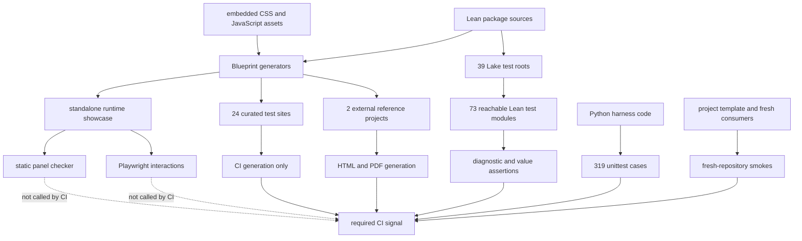

# Testing Infrastructure Review

Review date: 2026-07-22

Reviewed revision: `51ebcae4b3133f407807e581178d2dcc705ac683` (`v4.32.0`)

Scope: `src/VersoBlueprint`, Lean tests, Python harness tests, browser tests,
test and reference Blueprint fixtures, fresh-consumer smokes, and GitHub Actions
reachability.

## Executive summary

Verso Blueprint has a broad test corpus and several unusually valuable
end-to-end fixtures. The strongest areas are Lean elaboration and diagnostic
contracts, Python maintainer-harness behavior, fresh-consumer compatibility,
generated JavaScript API contracts, and production-scale external project
generation. The review found no failure in the package build, registered Lean
tests, 319 Python harness tests, JavaScript tooling, fresh project template,
real PDF smoke, or either current external reference project.

The main risk is not a lack of tests. It is a mismatch between what is tested,
what CI actually executes, and what a passing generator run proves:

1. Browser regressions are not a CI gate. The current Chromium suite has one
   stable failure and one order/seed-sensitive layout failure, while CI only
   generates the browser fixture.
2. A real Lean test module, `BlueprintBlockFolding`, contains seven message
   assertions but is outside the Lake test-driver import closure.
3. The 24 curated rendering fixtures are generated in CI but have no
   fixture-specific output oracle. The two current external references also
   declare `validations=none`, so their successful validation means generation
   and PDF compilation completed, not that the generated data or interactions
   are correct.
4. Some fixture setup temporarily rewrites tracked files. Running browser and
   harness work concurrently in one checkout caused a deterministic false
   failure in an otherwise passing harness suite.
5. Existing browser negative controls are strong, but the main static panel
   checker is weak against partial regressions: four of six single-occurrence
   HTML mutations survived.

The immediate recommendation is to establish a reliable browser CI lane and
fix its two current failures, then make Lean test reachability and generated
fixture oracles explicit. Code-coverage budgets should follow those correctness
repairs rather than substitute for them.

## Review method and terminology

This review used four kinds of evidence:

- **Reachability:** whether a test is in the import, command, and CI path that
  maintainers expect to run.
- **Feature coverage:** whether a public behavior has a positive case, negative
  case, integration case, and realistic consumer case.
- **Executed-code coverage:** branch-aware Python coverage and representative
  Chromium precise coverage. Lean import counts are only a structural proxy,
  not code coverage.
- **Oracle strength:** whether deliberately malformed inputs or output mutations
  cause a test to fail for the intended reason.

Raw review logs and generated evidence were written below
`_out/testing-infrastructure-review/testing-review/`. They are intentionally
untracked. This document records the durable conclusions and the commands
needed to reproduce them.

## System map



This map explains the central gap: generation is CI-reachable, but the static
and browser oracles attached to the standalone runtime fixture are not.

## Inventory

The counts below are measurements at the reviewed revision, not targets.

| Surface | Inventory | Assertion or validation shape |
| --- | ---: | --- |
| Lean package source | 92 `.lean` modules | Built by the package root; no line/branch instrumentation |
| First-party browser runtime | 24 `.mjs` and 4 `.css` source files | Type/API checks plus one generated browser showcase |
| Lean test source | 75 modules | 317 `#guard_msgs` blocks, 14 `#guard`s, and 294 `#eval`s |
| Lake test driver | 39 roots, 73 reachable modules | `lake test`, followed by one Python Lean-run integration check |
| Python test source | 24 files, 379 test functions/methods | 319 harness unittests and 60 browser cases on Chromium |
| Curated test Blueprints | 24 generated sites | Registry metadata and generation; no configured per-site validator |
| Standalone test Blueprints | 1 project | Static panel checker, 60 Chromium cases, optional Firefox parametrization |
| External references | 2 current projects | Real project update/build/generation/PDF; both declare `validations=none` |
| Fresh consumers | project template and two math-lint layouts | Temporary repositories with real Lake dependency resolution |

The number of `#eval` or `#guard_msgs` commands is not a test-case count. A
single command can validate a large serialized output, and many helper/provider
modules intentionally contain no assertion command.

## CI reachability

| Layer | Local canonical entry point | GitHub Actions | Assessment |
| --- | --- | --- | --- |
| Package build | `scripts/lean-low-priority lake build` | `ci.yml` | Required and healthy |
| Registered Lean tests | `./scripts/run-lean-tests.sh` | `ci.yml` | Required, but does not detect assertion-bearing orphan modules |
| Python harness | `python3 -m unittest discover ...` | `ci.yml` | Required and healthy |
| JavaScript types/API docs | npm type/declaration/doc commands | `ci.yml` | Required and healthy |
| Fresh project template | `check_project_template_fresh_repo.py` | PR-only `ci.yml` job | Required on PRs and healthy |
| Fresh math-lint consumers | `check_math_lint_fresh_repo.py` | `ci.yml` | Required; network-heavy and locally opaque |
| Curated and standalone site generation | `generate-test-blueprints.sh` | `reference-blueprints.yml` | Required generation only |
| Static panel regression | `validate-test-blueprints.sh` | Not called | Local-only signal |
| Chromium browser suite | `validate-test-blueprints.sh` | Not called | Local-only signal; currently failing |
| Firefox browser suite | explicit pytest option | Not called | Optional; system-browser fallback is environment-sensitive |
| External reference HTML/PDF | `generate-reference-blueprints.sh --pdf` | matrix job | Required and production-realistic |
| External reference semantic validation | catalog validators | No current validators | Empty for both current projects |
| Full branch composition | `validate-branch.sh` | Not called as a unit | Useful local composition, not a CI contract |

The reference workflow uploads generated test sites and reference artifacts.
Artifact publication is useful, but it should not be interpreted as an output
correctness assertion.

## Feature coverage assessment

| Feature family | Lean/unit | Generated fixture | Browser/consumer | Current confidence |
| --- | --- | --- | --- | --- |
| Informal blocks, metadata, labels, imports | Extensive diagnostics and serialized output assertions | Multiple curated sites | Selected runtime interactions | High for elaboration; medium for rendered behavior |
| Dependency graph, status, topology | Dedicated Lean modules | State and graph fixtures | Rich graph suite | High breadth; browser lane currently not gated |
| Preview manifests, cache, source metadata | Lean schema tests and Python API-contract checks | Standalone runtime showcase | Positive and malformed-input browser cases | Strong negative contracts; representative executed coverage is uneven |
| Relationships, groups, used-by panels | Lean rendering tests and curated sites | Several focused fixtures | Group and relationship interactions | Medium; current slides manifest loses a group field |
| External Lean declarations and code panels | Broad Lean rendering matrix | Large code-panel page | Static panel and browser checks | Broad, but static completeness oracle is weak |
| Rust, grafts, slides | Dedicated Lean tests and curated examples | Curated and standalone pages | Slides test plus custom client | Medium; slides browser test is currently failing |
| HTML/PDF generation | Generator tests and real smoke | All fixture families | Fresh template and external references | High for build completion, lower for semantic output correctness |
| CLI and harness workflows | Lean `vbp` tests and 319 Python tests | Temporary repositories | Fresh-consumer execution | High, with uncovered subprocess entry-point branches |
| Responsive layout and accessibility | Some geometry assertions | Runtime showcase | Mobile widths and alignment checks | Medium-low; no automated accessibility audit or screenshot baseline |
| Cross-browser behavior | None at unit level | Same runtime showcase | Firefox parametrization exists | Low; not CI-reachable and local system Firefox could not launch |

## Executed-code coverage

### Lean

Lean coverage is structural in this review because the project has no source
line/branch coverage pipeline. Of 75 test modules, 73 are in the Lake test
closure. The two outside it are the aggregate `VersoBlueprintTests.Blueprint`
module and `VersoBlueprintTests.BlueprintBlockFolding`; the latter contains
seven real message assertions. Running it directly passed in 2.0 seconds.

Tests explicitly import 26 of the 92 package modules. That is not a 28%
coverage result: umbrella imports and downstream generated projects exercise
many modules indirectly. It does show why direct-import counting cannot replace
an import-closure report or semantic feature matrix.

### Python

An isolated `coverage.py --branch --source=scripts` run passed all 319 harness
tests and measured:

- 68.2% statement coverage (3,350 of 4,911 statements);
- 52.9% branch coverage (841 of 1,590 branches);
- 64.5% combined report coverage.

Core modules range from 44% for `blueprint_harness_paths.py` to 100% for small
adapters. `blueprint_reference_harness.py` measured 57%,
`blueprint_test_blueprints.py` 66%, and the main `blueprint_harness.py` 76%.

Several executable scripts appear as 0% even though dedicated tests launch
them in subprocesses. Coverage was deliberately not propagated into child
processes, so those zeroes identify an instrumentation boundary as well as
potential missing branches. A future gate should enable subprocess coverage
before setting thresholds.

### JavaScript

A representative Chromium precise-coverage pass visited summary, graph, group,
relationship, code-panel, and custom-client routes, then hovered and scrolled.
It executed approximately 55.5% of the bytes in the 22 loaded first-party
Blueprint runtime scripts (159,103 of 286,588 bytes). This is a diagnostic
interaction smoke, not full-suite coverage.

The lowest first-party results were:

| Runtime module | Executed bytes |
| --- | ---: |
| `preview-runtime-source-metadata.mjs` | 12.0% |
| `relation-panel.mjs` | 24.4% |
| `inline-preview.mjs` | 40.3% |
| `graph.mjs` | 41.7% |
| `preview-runtime-surface.mjs` | 50.8% |
| `preview-runtime-hydration.mjs` | 51.4% |

The result is useful for prioritizing interactions, but it should not become a
budget until collection is integrated with the complete browser suite and
deduplicates route/script execution using a checked-in tool.

## Empirical results

### Passing baselines

| Command or layer | Result | Wall time | Peak RSS |
| --- | --- | ---: | ---: |
| Package build | 707 jobs passed | 3m49s | 1.89 GiB |
| Registered Lean tests and Lean-run integration | Passed | 14.7s | 1.78 GiB |
| Python harness | 319 passed | 6.9s baseline; 2.3s under isolated coverage | 55 MiB under coverage |
| JavaScript type/declaration/API-doc checks | Passed | 14.0s | 256 MiB |
| Fresh project template | Passed | 5m30s | 1.93 GiB |
| Static panel regression | Passed on unmodified output | Included in fixture validation | — |
| Real local PDF smoke | Passed | 3m54s | 1.91 GiB |
| Current external references | Noperthedron and FLT passed generation | 15m23s total | 4.65 GiB |
| Warm external reference PDFs | Both PDFs produced | 7m02s | 4.58 GiB |
| Curated determinism generation | Two 24-site roots produced | 42.8s | 906 MiB |

The external reference run is valuable generality evidence: Noperthedron built
3,217 jobs and FLT built 4,368 jobs against the catalog's `v4.32.0-rc1`
toolchain target. It does not provide semantic output validation because both
catalog entries have no validators.

### Chromium failures

The complete diagnostic run produced 58 passes, 2 failures, and 54 skipped
Firefox parametrizations in 7m23s.

1. **Stable slides manifest failure.**
   `test_generated_slides_render_static_shell_and_rewrite_links` raises
   `KeyError: 'group'` for the `collatz` manifest entry while expecting group
   `collatz_core`. A targeted rerun failed identically after 1m29s.
2. **Order/seed-sensitive source-chip layout failure.**
   `test_source_header_chip_opens_source_preview` expected source and uses chips
   to align within one pixel. The complete run differed by about 1,158 pixels.
   Three targeted repeats yielded pass, pass, fail; the failure differed by
   1,204 pixels. This should be treated as a real race/state-leak or unstable
   oracle until explained, not merely retried away.

The slowest browser setup phases were 146.8 seconds for a single-page graph
fixture and 117.7 seconds for slides. Individual interactions took up to 9.4
seconds. The canonical quiet validation command was interrupted after a long
period without progress; the verbose diagnostic run subsequently completed.
The scripts need bounded timeouts and progress reporting around pytest and
fixture builds.

### Firefox result

The Firefox selection did not reach product assertions. Playwright fell back
to `/usr/bin/firefox`, whose Snap launcher could not create its profile and
`XDG_RUNTIME_DIR` paths in the sandbox. The run ended with 6 browser-independent
passes, 54 Chromium skips, and 54 Firefox launch errors in 3m40s. This is an
environment portability failure, not evidence of Firefox product correctness
or incorrectness.

### Fresh math-lint smoke

The default temporary consumer passed its warning and `--wfail` checks. The
alternate `packagesDir` case first failed during `lake update` because a GitHub
dependency clone was interrupted. An isolated retry remained silent beyond the
review's bounded observation window and was stopped. The smoke is semantically
useful, but it combines network resolution, two fresh dependency trees, builds,
and negative compiler behavior in one opaque gate.

### Determinism

Two clean roots for all 24 curated fixtures contained the same 2,999 files.
2,975 files were byte-identical. The only mismatch in every fixture was
`html-multi/index.html`, where the visible `Compiled` UTC timestamp changed.

The output is therefore semantically stable in this experiment but not
byte-reproducible. This matters for artifact identity, cache efficiency, and
review diffs. The build timestamp should either honor `SOURCE_DATE_EPOCH`, be
supplied explicitly, or be kept outside the content-addressed artifact.

The supposedly warm reference `--skip-build --pdf` run still performed project
updates, embedded-asset owner rebuilds, and downstream Lake compilation. The
flag only skips one harness build phase; its name and help should make that
boundary explicit.

## Fixture quality and interactions

### Strengths

- Curated fixtures are small, named by behavior, categorized, and discoverable
  through one generated index.
- The standalone runtime showcase combines summary, graph, relationships,
  source metadata, cache behavior, code panels, custom clients, and slides.
- External references exercise large real projects rather than synthetic
  package shapes.
- Fresh template and math-lint smokes catch dependency, toolchain, package-path,
  and `--wfail` behavior that unit tests cannot model.
- Embedded-asset ownership has dedicated tests and proactive rebuild logic,
  reducing stale `include_str` output.
- Browser tests contain explicit malformed-cache, missing-source, malformed
  graph, missing-renderer, retry, and diagnostic-shape assertions.

### Weaknesses

- Curated fixture generation checks that rendering does not crash, but not that
  each fixture still contains the semantic feature named in its registry entry.
- The standalone showcase is a high-value integration fixture and a coupling
  hotspot. Its setup cost and broad shared state make failures expensive to
  localize.
- Current reference projects prove compatibility and scale but have no oracle
  beyond command success and PDF existence.
- Fixture families have distinct catalogs and lifecycles. Their unified HTML
  index helps humans, but CI semantics remain distributed across Lake roots,
  JSON manifests, Python code, shell wrappers, and workflow files.

### Same-checkout concurrency

Running the Firefox browser probe and Python coverage concurrently exposed an
interaction defect. The slides fixture temporarily rewrites
`project_template/lakefile.lean`; during that window, the otherwise passing
harness test
`test_project_template_blueprint_dependency_tracks_active_release_branch`
failed to find the expected dependency line. Re-running the harness alone
passed all 319 tests.

GitHub jobs use separate checkouts, so this does not currently create a CI race.
It does make local parallelism and shared worktree automation unsafe. Fixture
setup should operate on temporary copies or generated inputs, never transiently
change tracked files visible to another test process.

## Robustness and oracle strength

Twelve focused negative/mutation probes were evaluated.

Six browser controls injected legacy or missing runtime data. All passed:

- legacy array-shaped HTML cache;
- missing manifest source location;
- missing source document;
- missing source metadata;
- external-markup diagnostic variants;
- initial cache fetch failure followed by retry.

Six disposable generated-HTML mutations were then checked with the static panel
oracle. It killed two:

- changing the expected issue-130 subsection label;
- injecting a forbidden stale external-panel caption.

Four survived because another occurrence still satisfied a global presence
check:

- one complete-status badge class removed;
- one definition caption changed;
- one source-path CSS selector changed;
- one code-panel-specific declaration-kicker selector changed.

The resulting score, 8 killed of 12 total probes, should not be treated as a
universal mutation score. It demonstrates a specific asymmetry: runtime schema
failure behavior is well asserted, while static page completeness relies too
often on existential string checks. Static checks should enumerate expected
node identities and validate counts or per-node contracts.

## Findings and priority

### P0 — restore a truthful browser release signal

Add a CI job that generates the standalone test site and runs its static panel
and Chromium suites. Fix the stable slides group omission and explain/fix the
source-chip state/layout instability before making the job required.

Acceptance criteria:

- the current 60 Chromium cases pass in CI;
- the slides test passes in five isolated runs;
- the source-chip test passes in at least 20 seeded/order-varied runs;
- pytest and expensive fixture setup have timeouts and periodic progress;
- a test-site artifact and failure traces are uploaded on failure.

### P1 — make Lean test registration complete by construction

Register `VersoBlueprintTests.BlueprintBlockFolding` and add a meta-check that
fails when an assertion-bearing module below `tests/VersoBlueprintTests` is
outside the test-driver import closure. Helper/provider allowlists must be
explicit and should not be based only on filename patterns.

Acceptance criteria:

- all seven block-folding assertions run under `lake test`;
- the reachability check reports every source module, root, and reason for an
  intentional exclusion;
- adding a new orphan assertion module fails CI.

### P1 — attach semantic oracles to generated fixture families

Give every curated fixture a small declarative contract: expected manifest
labels, graph nodes/edges, summary entries, HTML selectors/counts, or expected
diagnostics. Configure at least schema/integrity/link validation for every
external reference, and run a small browser smoke against one real reference.

Acceptance criteria:

- every curated fixture has at least one feature-specific assertion;
- reference `validate` performs more than generation for every published
  project;
- deleting one named feature from each fixture is detected;
- validators are declared in the fixture catalog rather than hidden in CI.

### P1 — isolate mutable fixture setup

Move slide, template, and package rewrite setup to temporary project copies or
process-private worktrees. Document which artifact caches may be shared and
which paths are exclusive.

Acceptance criteria:

- browser and harness suites pass when run concurrently in one source checkout;
- tests do not change `git status`, even transiently;
- interrupted fixture setup needs no source-tree restoration.

### P1 — strengthen static output checks

Replace global substring checks with parsed, per-node assertions and expected
counts. Keep a small mutation corpus for code panels, group sections, source
links, status badges, and captions.

Acceptance criteria:

- all six mutations from this review are killed;
- failures identify the missing node/selector rather than only a global token;
- the checker remains fast enough for the normal CI browser job.

### P2 — establish measured coverage lanes

Check in coverage tooling rather than relying on ad hoc commands.

- Enable subprocess-aware Python branch coverage and first set a non-regression
  baseline; prioritize paths, reference orchestration, identity, and test-site
  validation branches.
- Collect Chromium precise coverage during the real browser suite. Add
  interactions for source metadata, relation panels, inline previews, and graph
  options before considering a numeric budget.
- For Lean, generate an import/reachability and feature-to-test matrix. Do not
  publish direct-import percentages as code coverage.

Acceptance criteria:

- reports are CI artifacts on every PR;
- subprocess entry points are measured correctly;
- budgets apply to changed code or prevent regression without rewarding
  low-value execution.

### P2 — split fast, integration, and reference lanes

Keep a fast required lane for registered Lean tests, harness tests, JavaScript
contracts, static fixture contracts, and a focused browser smoke. Run the full
browser suite in a required integration lane with cached/generated fixtures.
Keep the 4–5 GiB external reference/PDF jobs matrixed and independently
retryable.

Acceptance criteria:

- each lane has a documented target duration and resource ceiling;
- fixture generation occurs once per job and is reused by validators;
- quiet subprocesses emit heartbeats and phase timings;
- network resolution failures are distinguishable from product failures.

### P2 — make browser and output reproducibility explicit

Use Playwright-managed browser versions or a pinned container instead of system
Snap fallbacks in CI. Define the supported browser matrix. Add a reproducible
build-time input and normalized artifact comparison.

Acceptance criteria:

- Chromium and the chosen secondary browser launch without host-specific paths;
- repeated curated generation is byte-identical under a fixed build epoch;
- PDF comparison distinguishes expected metadata differences from content
  changes;
- `--skip-build` documentation states which updates and rebuilds still occur.

### P3 — maintenance follow-ups

- Address or explicitly accept the four high-severity npm audit findings in the
  development dependency tree observed after `npm ci`.
- Add an automated accessibility scan for the representative pages and retain
  targeted geometry assertions for layout behavior.
- Reduce duplicate warning noise during repeated fixture generation so real
  failures remain visible.

## Recommended target model

The test system should converge on one declaration per fixture with these
fields:

| Field | Purpose |
| --- | --- |
| Identity and category | Human discovery and ownership |
| Source/generation command | How the artifact is built |
| Required semantic contract | Manifest/data/selector assertions |
| Interaction suite | Browser tests and supported browsers |
| Cost/lane | Fast, integration, reference, or scheduled |
| Isolation class | Pure, temporary copy, exclusive checkout, external network |
| Artifact policy | Retention, reproducibility normalization, and upload paths |

The declaration need not force Lean, JSON, and external repositories into one
implementation. It should be the source of truth from which local validation,
CI matrices, reachability reports, and the human fixture index are derived.

## Reproduction ledger

The principal commands used by this review were:

```text
scripts/lean-low-priority lake build
./scripts/run-lean-tests.sh
python3 -m unittest discover -s tests/harness -p 'test_*.py'
npm ci
npm run typecheck
npm run build:types
npm run check:types
./scripts/generate-js-api-docs.sh
python3 scripts/check_project_template_fresh_repo.py
./scripts/validate-test-blueprints.sh --run-real-pdf-smoke
python3 -m pytest tests/browser --browser chromium --site-dir <generated-site>
./scripts/validate-reference-blueprints.sh --allow-local-build --serial
./scripts/generate-reference-blueprints.sh --allow-local-build --serial --skip-build --pdf
```

Coverage, repeat, determinism, and mutation commands used review-only helpers
under the ignored evidence directory. Before implementing numeric gates, promote
the chosen collectors into maintained scripts with unit tests and stable output
schemas.

## Review limitations

- No statement/branch instrumenter was added for Lean; its code coverage remains
  unmeasured.
- Firefox product behavior was not evaluated because the local system browser
  could not launch in the sandbox.
- The full browser diagnostic used Chromium and one generated runtime showcase;
  it did not browse all 24 curated sites or the external references.
- PDF checks asserted successful production and non-empty files, not visual or
  semantic equivalence.
- Network-dependent fresh-consumer behavior was observed from one machine and
  should be confirmed in CI telemetry before assigning a reliability budget.

These limitations do not weaken the highest-priority findings: browser checks
are absent from CI, a real Lean test is unreachable, generated fixture oracles
are incomplete, and same-checkout fixture mutation breaks safe parallelism.
